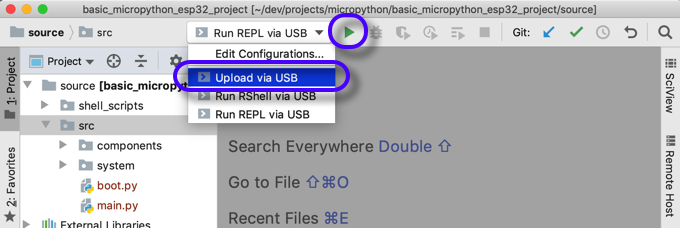

# Basic project on MicroPython for ESP32 board

[MicroPython](http://docs.micropython.org/en/latest/index.html)

Install
* USB driver for ESP32 board
  * [FTDI](https://www.ftdichip.com/Drivers/VCP.htm)
  * [Silicon Labs](https://www.silabs.com/products/development-tools/software/usb-to-uart-bridge-vcp-drivers)
* Connect the board to the computer and find its USB path
```
$ls /dev/cu*
/dev/cu.SLAB_USBtoUART

$ls /dev/ttyUSB*
/dev/ttyUSB0
```
* [rshell](https://pypi.org/project/rshell/) - Remote MicroPython shell ([GitHub](https://github.com/dhylands/rshell))
`pip install --user rshell`
* IntelliJ [PyCharm](https://www.jetbrains.com/pycharm/)
* IntelliJ PyCharm plugin [MicroPython](https://github.com/vlasovskikh/intellij-micropython)
## Optionally
* Install [MicroPython](https://github.com/micropython/micropython)
Get MicroPython source
```
cd ~ && mkdir dev && cd dev
git clone https://github.com/micropython/micropython.git
```
Build the cross-compiler
```
cd micropython/mpy-cross && make
```
Navigate back to the `micropython` folder
```
cd ..
```
Update submodules
```
git submodule update --init
```
Add development componebts for libffi
```
sudo apt-get install libffi-dev
```
Navigate to the Unix port folder and build the MicroPython. `MICROPY_PY_FFI=1` includes library `libffi`, which is _a portable foreign-function interface library_ (on [GitHub](https://github.com/libffi/libffi)).
```
cd ports/unix
make MICROPY_PY_FFI=1
```
There is a good chance to see errors like:
_modffi.c:32:17: fatal error: ffi.h: No such file or directory_
or _Package libffi was not found in the pkg-config search path_
or _Perhaps you should add the directory containing libffi.pc_
Options to overcome this:
1. Built the MicroPython without this library. Some functions will not be available *as far as I understood)
```
make MICROPY_PY_FFI=1
```
2. Check if an environment variable PKG_CONFIG_PATH points to the folder, containing the folder `pkg_config` and a file `libffi.pc`. If not - fix this, restart the terminal and try to build again.
```
printenv PKG_CONFIG_PATH
```
To change it - edit a file `~/.bash_profile` or a file `~/.bashrc` (and restart the terminal)
3. Install `libffi-dev`
```
sudo apt-get install libffi-dev
```
* Install [upip](https://pypi.org/project/micropython-upip/) - MicropPython package manager
```
pip install micropython-upip
```
* Install Telnet client
* Install FarManager ([Linux, MacOS](https://github.com/elfmz/far2l), [Windows](https://www.farmanager.com/)). It has very good FTP client.

## Workflow
* In PyCharm - create a new Pure Python project
* Add PyCharm plugin MicroPython

* Set the project interpreter

* Enable the MicroPython for the project

* Add Run configurations - with Shell scripts


* Start upload files with `rshell`

